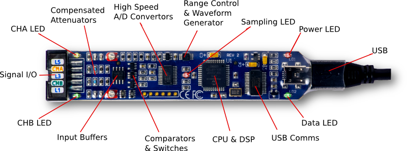

[](https://www.python.org/downloads/release/python-2715/)  [](https://badge.fury.io/py/bitscope) [](http://bitscope.com/software/library/guide/2.0/#blindex-assign-the-buffer-offset-for-dumps)  [](https://github.com/codenio/bitscope/blob/master/LICENSE)

# bitscope

**bitscope** is a comprehensive library for programming and data collection from [Bitscope Micro](http://bitscope.com/product/BS05/).

<p align="center">
  
</p>

It is a python wrapper for **bitlib** package installed using [**bitscope-library_2.0.FE26B**](docs/BitScopeLibraryGuide.pdf) and [**python-bindings-2.0-DC01L**](src/python-bindings-2.0-DC01L.zip)


## Usage

```diff
#!/usr/bin/env python

import matplotlib.pyplot as plt
import numpy as np
- from bitlib import *
+ from bitscope import *

# initialisation of scope collects all the device data and stores them in
# scope.devices list 
- BL_Open('USB:/dev/ttyUSB1',1)
+ scope = Scope('USB:/dev/ttyUSB1',1)

# collect the list of devices
devices = scope.devices

#Setup acquisition in FAST mode, where the whole of the 12288 samples in
#the buffer are used by one channel alone.
- BL_Select(BL_SELECT_DEVICE,0)
- BL_Mode(BL_MODE_FAST)

+ devices[0].mode(BL_MODE_FAST)


#Setup channel-nonspecific parameters for capture.
#How many seconds to capture before the trigger event- 0 by default
- BL_Intro(BL_ZERO)
#How many seconds to capture after the trigger event- 0 by default
- BL_Delay(BL_ZERO) 
# optional, default BL_MAX_RATE
- BL_Rate(MY_RATE)
# optional default BL_MAX_SIZE
- BL_Size(MY_SIZE)

+ scope.tracer.configure(
+     rate=BL_MAX_RATE, 
+     size=BL_MAX_SIZE, 
+     pre_capture=BL_ZERO, 
+     post_capture=BL_ZERO
+ ) 

#Set up channel A properties - A has channel index 0, B has 1.
#All the subsequent properties belong to channel A until another is selected.
- BL_Select(BL_SELECT_CHANNEL,0);
# use the POD input - the only one available
- BL_Select(BL_SELECT_SOURCE,BL_SOURCE_POD);
# Y-axis offset is set to zero as BL_ZERO
- BL_Offset(BL_ZERO)
# maximum range for y-axis - use this whenever possible
- BL_Range(BL_Count(BL_COUNT_RANGE)) 

+ devices[0].channels[0].configure(
+    source=BL_SOURCE_POD,
+    offset=BL_ZERO,
+    range=BL_Count(BL_COUNT_RANGE)
+)


#Enable the currently selected channel, i.e. channel A
#This ensures the recorded data goes into the memory-buffer in Bitscope device
- BL_Enable(TRUE);
+ devices[0].channels[0].enable()


- BL_Trace(0.01,BL_SYNCHRONOUS)
+ scope.tracer.trace(0.01,BL_SYNCHRONOUS)

- Data = BL_Acquire()
+ Data = devices[0].channels[0].acquire()
print Data
```

## Install

- clone this repository using
    ```bash
    $ git clone git@github.com:codenio/bitscope.git
    ```
- install `bitlib` library from ./src directory for your Operating System (identified by file suffix):

    - Windows (all) => [i386.zip](src/bitscope-library_2.0.FE26B_i386.zip)
    - Machintosh (all) => [app.tgz](src/bitscope-library_2.0.FE26B.app.tgz)
    - Raspberry Pi => [armhf.deb](src/bitscope-library_2.0.FE26B_armhf.deb)
    - Debian Linux 32 bit => [i386.deb](src/bitscope-library_2.0.FE26B_i386.deb)
    - Fedora Linux 32 bit => [i386.rpm](src/bitscope-library-2.0.FE26B-1.i386.rpm)
    - Debian Linux 64 bit => [amd64.deb](src/bitscope-library_2.0.FE26B_amd64.deb)
    - Fedora Linux 64 bit => [x86_64.rpm](src/bitscope-library-2.0.FE26B-1.x86_64.rpm)
    
    #### to install in ubuntu 18.04 64 bit

    ```bash
    # cd into bitscope/src/ directory
    $ cd bitscope/src/
    
    # install the bitscope-library_2.0 debian package
    $ sudo apt-get install bitscope-library_2.0.FE26B_amd64.deb
    ```

- to use bitlib in python2
    ```shell
    # to install python2 binding
    # unzip and cd into bitscope/src/python-bindings-2.0-DC01L/ 
    $ unzip python-bindings-2.0-DC01L.zip
    $ cd python-bindings-2.0-DC01L/
    
    # install bitlib using the python-binding script 
    $ sudo python setup-bitlib.py install
    
    # in case of errors.. try
    $ sudo BASECFLAGS="" OPT="" CFLAGS="-O3" python setup-bitlib.py install
    ```
    Note: the files, debian packages and steps to install were taking from [murgen-dev-kit](https://github.com/kelu124/murgen-dev-kit/tree/master/software). thanks to [K.Ghosh](https://github.com/kelu124)

- to use bitlib in python3
    ```shell
    # to install python3 binding
    # unzip and cd into bitscope/src/python3-bindings-2.0-DC01L/ 
    $ unzip python3-bindings-2.0-DC01L.zip
    $ cd python3-bindings-2.0-DC01L/
    
    # install bitlib using the python-binding script 
    $ sudo python3 setup-bitlib.py install
    
    # in case of errors.. try
    $ sudo BASECFLAGS="" OPT="" CFLAGS="-O3" python3 setup-bitlib.py install
    ```
    Note: visit [python3-bindings-2.0-DC01L](https://github.com/codenio/python3-bindings-2.0-DC01L) for further details.

- to install stable version of **bitscope** package
    ```bash
    $ sudo pip install bitscope
    ```
- connect your bitscope to your pc and test the functionality using
the example file at `examples/basics/bitscope-read-data.py`
    ```bash
    $ python examples/basics/bitscope-read-data.py
    ```

## Documentation

- [Library Overview](docs/liberary-overview/README.md)
- [Library Reference](https://htmlpreview.github.io/?https://github.com/codenio/bitscope/blob/master/docs/liberary-reference/bitscope.html)
- [Examples](examples)
    - [Basics](examples/basics)
    - [Matplotlib](examples/matplotlib)

## Develope

- make the suitable changes and from the root directory of this repository, install the bitscope python package using the install.sh script
    ```bash
    $ sudo ./scripts/install.sh
    ``` 

## Contribute

- You've discovered a bug or something else you want to change - excellent! - feel free to raise a issue.
- You've worked out a way to fix it – even better! - submit your PR
- You want to tell us about it – best of all!

Start contributing !